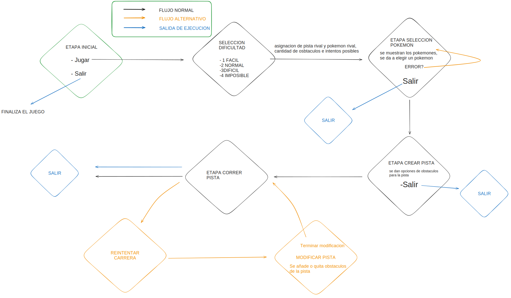

# TP: Carrera de obstáculos

## Repositorio de Agustin Demicheli - 111032 - ademicheli@fi.uba.ar

- Para compilar:

```bash
make juego
```

- Para ejecutar:

```bash
./juego
```

- Para ejecutar con valgrind:
```bash
valgrind --leak-check=full --track-origins=yes --show-reachable=yes --error-exitcode=2 --show-leak-kinds=all --trace-children=yes ./juego
```
---
##  Funcionamiento

Explicación de cómo funcionan las estructuras desarrolladas en el TP y el funcionamiento general del mismo.

El funcionamento de este trabajo inicia con el comando para compilar del makefile provisto por la catedra, una vez se encuentra compilado se usa el comando para ejecutar y ahí inicia el juego, se muestra un mensaje de bienvenida e inicia el juego, se muestran las opciones de jugar o salir (y cabe destacar que en todo momento el jugador puede decidir salir del juego), al darle a jugar comienza el juego, se le pide al jugador que seleccione una dificultad y en base a eso se arma una pista de n longitud y se asigna un pokemon aleatoreamente a su rival, se muestra por pantalla solo algunos osbtaculos de la pista del rival y el usuario tiene la opcion de seleccionar su propio pokemon de la pokedex que posee el juego, luego debe armar la pista de tamaño indiscriminado y con los obstaculos a elección y puede correr contra el rival, tras cada intento se muestran los tiempos de los pokemones y el puntaje obtenido dandole chances al jugador en caso de querer reintentar la carrera, donde puede modificar la pista de obstaculos propia y volver a correr, dicha cantidad de intentos depende de la dificultad seleccionada al inicio del juego, finalmente una vez que desee salir el programa se despide del jugador.

<div align="center">

</div>


## Respuestas a las preguntas teóricas

Para el desarrollo del TDA TP, decidí afrontar desde varios lugares la forma de hacer su implementacion, por una parte generé un archivo donde almacené funciones que por un lado no tengan que ver en si con el tda tp sino que son de utilidad o que validen el ingreso de un archivo, obvio tiene que ser válido y lo que eso conlleva, si el formato del nombre de archivo es aceptable, si el formato del contenido del archivo es válido, si el archivo existe o no; 
Como resultado tengo un tp que se crea si y solo si se cumplen estas validaciones, y son de gran utilidad porque me ayudaron a verificar la entrada al segundo camino, el mapeo de pokemones en el tp ¿Cuál sería una forma interesante y o eficiente si se quisiera decir de realizar este mapeo? la solución a esta pregunta que me hice fue un árbol binario de búsqueda, y ¿Por qué? porque es dentro de los tdas vistos en la materia uno de los más eficientes a la hora de buscar elementos a traves de si mismo, con una búsqueda cuyo costo/complejidad temporal es logarítmica por la propiedad misma que cumple el llamado abb_t-> los subarboles izquierdos son menores que el nodo padre y este es menor a su vez que los subarboles izquierdo y con un buen criterio de comparacion la búsqueda se va diviendo por dos (asumiendo que el arbol esta balanceado);
por otra parte,el desarrollo de una estructura para los jugadores al que le asigné un pokemon_seleccionado y una pista, ciertamente no creí necesario guardar además el dato del numero de jugador, más bien diseñé una funcion que asigne los roles por asi decirlo de jugador numero 1 y numero 2, salidos del enum TP_JUGADO.
Y por ultimo , había que de alguna u otra forma encarar el problema de la pista la cuál contiene obstáculos en la posicion que el usuario decida, y como es una carrera donde ningún pokemón se queda sin terminarla me trajo a la cabeza otro tda visto en la cursada, un tda cuyo orden de elementos es dado por quien lo utilice, la lista, que reutilicé para darle cuerpo a la pista y use sus métodos en muchas de las funciones atribuidas al tda tp. Un ejemplo de ello fue usar el iterador interno de la lista con funciones auxiliares y una estructura que definí como contexto_t a la que le asigné las distintas variables que usé en las funciones auxiliares, para poder mostrar los obstaculos de la pista, o recopilar los tiempos por cada obstaculo y mostrar el tiempo total de un pokemon en completar una carrera, logrando modularizar y reutilizar funciones.
A continuación paso a dejar por escrito el listado de funciones escritas y su complejidad:

Validaciones:

Nombre_archivo_valido_ -> O(n) siendo n la longitud del nombre del archivo
```c
 bool nombre_archivo_valido(const char *nombre_archivo)
```
contiene_formato_correcto -> O(n²) ya que ejecuta la funcion validar_linea hasta que se paren de obtener lineas del archivo
```c
bool contiene_formato_correcto(const char *nombre_archivo)
```
validar_linea -> O(n) donde n depende de la cantidad de campos que posea una linea
```c
bool validar_linea(char *linea)
```
campo_valido -> O(n) donde n depende de la longitud del campo a validar
```c
bool campo_valido(const char *campo, int indice)
```
Funciones de utilidad/auxiliares:

str_tolower -> O(n) donde n depende de la longitud del string a transformar el texto en minúsculas
```c
void str_tolower(char *str)
```

actualizar_tiempos -> O(1) solo son asignaciones de valores a variables pasadas por parámetro
```c
int actualizar_tiempos(int cualidad_pokemon, int *n_cualidad_a_aumentar,
		       int *n_cualidad_reseteo_1, int *n_cualidad_reseteo_2)
```

mostrar_tiempo_obstaculos -> O(n) ya que se realizan operaciones como strlen que es O(n) realloc y strcat que en su mayoria dependen de una longitud dada por un string de n caracteres

```c
bool mostrar_tiempo_obstaculos(void *elemento, void *auxiliar)
```

mostrar_obstaculos -> O(n) dependiendo de la longitud de un string de n caracteres 
```c
bool mostrar_obstaculos(void *elemento, void *auxiliar)
```
agregar_nombre_al_string -> O(n) con n dependiendo de la longitud del string 

```c
bool agregar_nombre_al_string(void *elemento, void *auxiliar)
```

comparador_pokemon -> O(n) donde n depende de la longitud de los nombre de los pokemones a comparar 
```c
int comparador_pokemon(void *pokemon1, void *pokemon2)
```

Funciones de TDA jugador:

crear_jugador -> O(1) 
```c
jugador_t *crear_jugador()
```
destruir_jugador -> O(n) en el peor de los casos ya que se libera la memoria de cada elemento de la pista asignada al jugador, la pista y el jugador
```c
void destruir_jugador(TP *tp, enum TP_JUGADOR jugador_id)
```
asignar_pokemon -> O(1) se le asignan valores a punteros
```c
bool asignar_pokemon(jugador_t *jugador, const struct pokemon_info *pokemon)
```
asignar_jugadores -> O(1) asignacion de valores a punteros 
```c
void  asignar_jugadores(tp, jugador, &jugador_actual, &jugador_rival);
```
validar_seleccion_jugador -> O(n) con n dependiendo de la longitud de los nombres de los pokemones que se seleccionan
```c
bool validar_seleccion_jugador(jugador_t *jugador, const char *nombre)
```


Funciones de TDA pokemon_info:

crear_pokemon -> O(n) donde n depende de la longitud del campo a asignar como nombre del pokemon 
```c
struct pokemon_info *crear_pokemon(char *campo)
```

completar_pokemon -> O(n) con n dependiendo de la longitud del nombre del pokemon 
```c
struct pokemon_info *completar_pokemon(struct pokemon_info *pokemon,
				       char *campo, int indice)
```

mapear_pokemones -> O(n) y digo que es lineal y no cuadrática porque si bien hay dos ciclos while anidados uno de los ciclos se ejecuta hasta 4 veces en el peor de los casos por lo que hace que sea lineal es el while principal  O(n) * O(4) = O(n)
```c
abb_t *mapear_pokemones(const char *archivo, abb_t *abb_pokemones)
```

destruir_pokemon -> O(1) libera la memoria pedida por pokemon_t
```c
void destruir_pokemon(void *elemento)
```


Funciones de TDA obstaculo :

crear_obstaculo -> O(1) pide la memoria para un tamaño de bloque definido
```c
obstaculo_t *crear_obstaculo(enum TP_OBSTACULO tipo)
```

destruir_obstaculo() -> O(1) libera la memoria del obstaculo pedido
```c
void destruir_obstaculo(obstaculo_t *obstaculo)
```

Funciones de tda TP: 


tp_crear() -> O(n) ya que se realiza las validaciones de archivo y mapeo de pokemones que llevan una complejidad lineal

```c
TP *tp_crear(const char *nombre_archivo)
```

tp_cantidad_pokemon() -> O(1) devuelve una propiedad del abb que almacena los pokemones 

```c
int tp_cantidad_pokemon(TP *tp)

```

tp_buscar_pokemon() -> O(n log m) esto se debe a que la búsqueda en un abb asumiendo que este se encuentra balanceado es logaritmico sin embargo, la funcion de comparador de pokemon es lineal por lo que se puede calcular como O(n)*O(log m) donde n depende de los nombres de los pokemones y m de la cantidad de subarboles

```c
const struct pokemon_info *tp_buscar_pokemon(TP *tp, const char *nombre)
```


tp_nombres_disponibles() -> O(m*n) donde n depende de la longitud del string y m de la cantidad de subarboles 
```c
char *tp_nombres_disponibles(TP *tp)
```

tp_seleccionar_pokemon() -> O(nlog m) donde n depende del tamaño de los nombres y m de la cantidad de subarboles del abb que contiene los pokemones 
```c 
bool tp_seleccionar_pokemon(TP *tp, enum TP_JUGADOR jugador, const char *nombre)
```

tp_pokemon_seleccionado() -> O(1) devuelve el valor del pokemon_seleccionado del jugador
```c
const struct pokemon_info *tp_pokemon_seleccionado(TP *tp,
						   enum TP_JUGADOR jugador)
```

tp_agregar_obstaculo() -> O(n) / O(1) mejor de los casos  ya que el insertar en una posicion en la lista requiere avanzar atraves de n nodos hasta alcanzar la posicion deseada
```c
unsigned tp_agregar_obstaculo(TP *tp, enum TP_JUGADOR jugador,
			      enum TP_OBSTACULO obstaculo, unsigned posicion)
```

tp_quitar_obstaculo() -> O(n) / O(1) en el mejor de los casos ya que eliminar de una posicion de la lista requiere avanzar n nodos hasta llegar a la posicion deseada 
```c
unsigned tp_quitar_obstaculo(TP *tp, enum TP_JUGADOR jugador, unsigned posicion)
```

tp_limpiar_pista() -> O(n) se eliminan los obstaculos del a lista hasta que quede vacia depende de la n cantidad de obstaculos que contenga la pista 
```c
void tp_limpiar_pista(TP *tp, enum TP_JUGADOR jugador)

```
tp_obstaculos_pista() -> O(n*m) esto se debe a que se itera a través de toda la pista e n cantidad de obstaculos aplicando una funcion con complejidad lineal O(m) que depende de la longitud del string a medida que se registran los obstaculos
```c
char *tp_obstaculos_pista(TP *tp, enum TP_JUGADOR jugador)
```

tp_tiempo_por_obstaculo() -> O(n*m) esto se debe a que se itera a través de toda la pista e n cantidad de obstaculos aplicando una funcion con complejidad lineal O(m) que depende de la longitud del string que se va formando a medida que se  registran los tiempos
```c
char *tp_tiempo_por_obstaculo(TP *tp, enum TP_JUGADOR jugador)
```

tp_tiempo_por_obstaculo() -> O(n*m) ya que se invoca la funcion tp_tiempo_por_obstaculo y depende tambien del tamaño del string formado por esta ultima funcion 
```c
unsigned tp_calcular_tiempo_pista(TP *tp, enum TP_JUGADOR jugador)
```

tp_destruir() -> O(n) se liberan todos los nodos solicitados por el abb (para ello es recorrido) y se destruye toda la memoria solicitada por el tp 
```c
void tp_destruir(TP *tp)
```


Por otra parte decidi hacer un tda_menu que que contenga las distintas opciones en el juego, y con el control de la entrada por consola va interactuando con las funciones de dichas opciones, además use una estructura de estado que contenga las etapas por las que el juego esta pasando, el TP, los intentos posibles de reintentar la carrera, el archivo de donde se mapean los pokemones,la dificultad seleccionada y un flag para poder salir del juego cuando se solicite, lo cual me facilita el accionar con dichas funciones y asi poder hacer el funcionamiento del tp descripto.